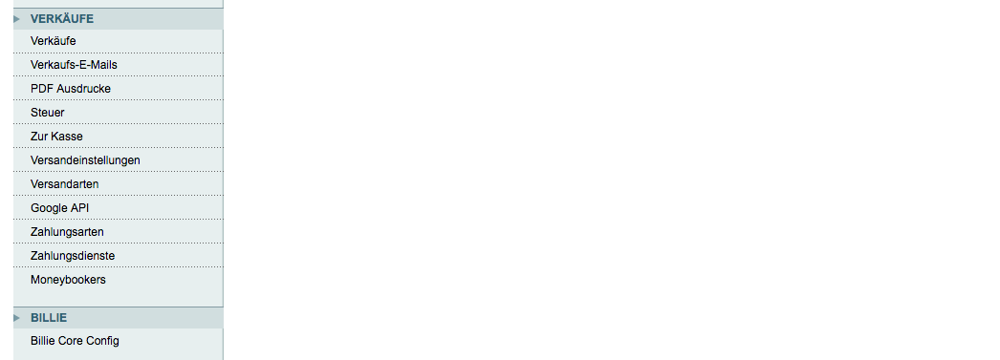
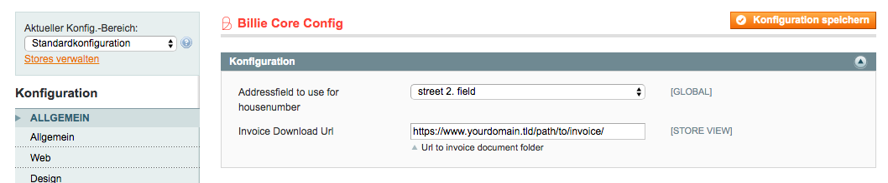
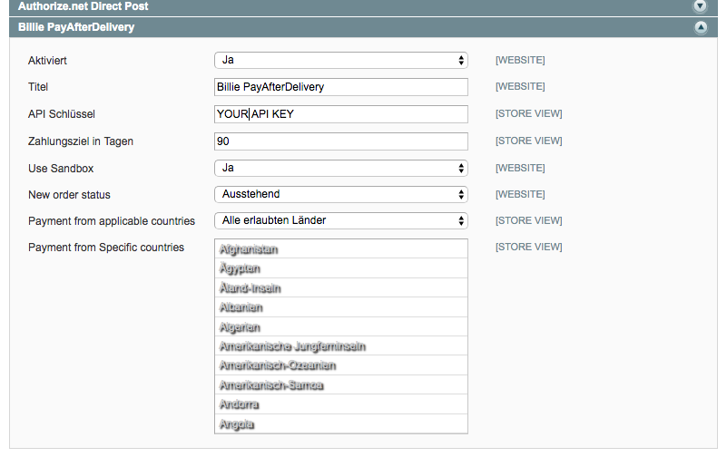
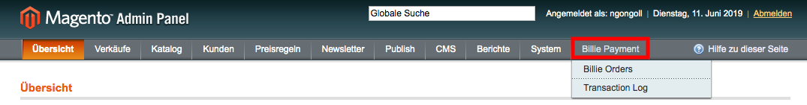
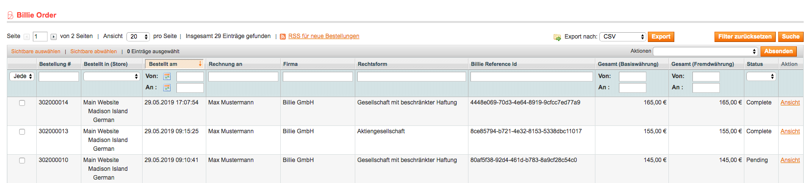
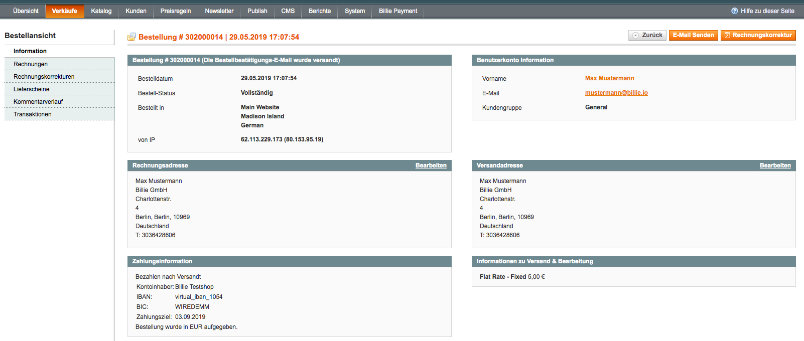
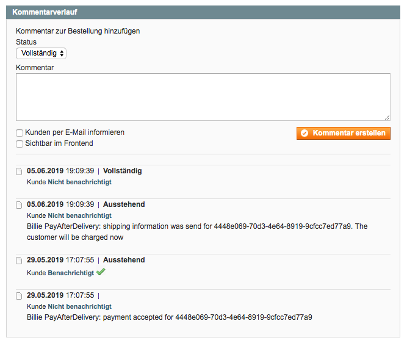
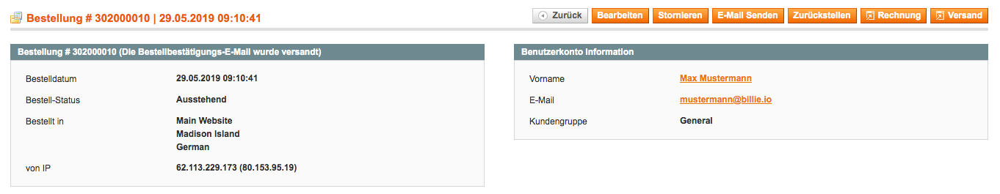

# Billie Pay after delivery

Billie Paymentmethod for Magento 1.9.x

## Requirements
- PHP 5.6 or higher 
- 1.9.0.0 or higher

## Installation

Download Source and copy into Magento root folder 
Clear Magento Caches and login again 
Goto System -> Configuration -> Billie Core Config

Billie and configure housenumber and invoice URL 

Goto Paymentmethods and configure Billie PayAfterDelivery method. 

Ready to go

Additional configuration 
Goto System -> Configuration -> Customer -> Create account -> enable Vat visibility in frontend 
Goto System -> Configuration -> Customer -> Customer address head -> Enable prefix and use for male one of (Male,Mister,Herr,Mann) and for female one of (Female,Miss,Frau)

## Information

by install billie pay after delivery. The company field becomes mandatory. 

Change in file app/design/frontend/base/default/template/checkout/onepage/billing.phtml and app/design/frontend/base/default/template/persistent/onepage/billing.phtml or in your local theme folder

    <label for="billing:company"><?php echo $this->__('Company') ?></label>
    

        <input type="text" id="billing:company" name="billing[company]" value="<?php echo $this->escapeHtml($this->getAddress()->getCompany()) ?>" title="<?php echo Mage::helper('core')->quoteEscape($this->__('Company')) ?>" class="input-text <?php echo $this->helper('customer/address')->getAttributeValidationClass('company') ?>" />
    
    
to
    
    <label for="billing:company" class="required"><em>*</em><?php echo $this->__('Company') ?></label>
    

        <input type="text" id="billing:company" name="billing[company]" value="<?php echo $this->escapeHtml($this->getAddress()->getCompany()) ?>" title="<?php echo Mage::helper('core')->quoteEscape($this->__('Company')) ?>" class="input-text required <?php echo $this->helper('customer/address')->getAttributeValidationClass('company') ?>" />                        
    
    

## Dokumentation

#### Billie orders:

Under Billie Payments -> Billie Order you find all orders made with billie payment. You can sort and filter the columns as needed. The grid contains the following data 

* Bestellung: magento order increment_id
* Bestellt in (Store): Storeview
* Bestellt am: order create date
* Rechnung an: order billing name
* Firma: company name
* Rechtsform: legal form
* Billie Reference Id: Billie reference ID 
* Gesamt: billing grand total
* Status: status of order 
* Aktion: link to order detail

#### Order Detail

In order detail you find the payment information block. Where you can find find the payment information for the client.

In comment history you can find all billie actions only viewable for the admin

Before Billie is invoicing the client. The order has to be invoiced and shipped. There for use the magento default buttons.

You can cancel an order with magento default cancel button. Notice that an order which is already pay out can't be pay back by billie. You will get an notice in magento.

## Contact
Billie GmbH 
Charlottenstraße 4 
10969 Berlin 

## License
